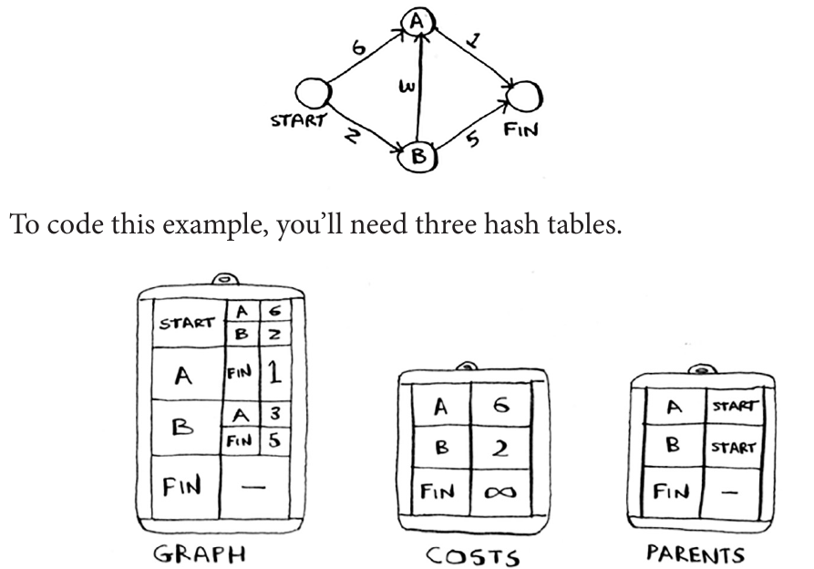

# Algorithms and Data Structure

## 3-Recursion

Every Recursion Function Has Two Parts [The Base Case , The Recursive Case] <br/>

1- Base Case is When The Function Doesn't Call it Self Again <br/>
2- Recursive Case is When the function call it Selft Again <br/>

For Example Simple Count Down Function Using Recursion

```javascript
const countDown = (i) => {
  console.log(`Current Value = ${i}`);
  if (i <= 0) return; // Base Case When Doesn't Call it Self Again
  countDown(i - 1); // Recursive Case when Function call it Self Again
};
```

### Stack

Stack on of the Most Common Data Structure you've been using Whole Time Without Realizing it
Like **Call Stack** <br/>
Stack is simple Data Structure When Contains of Two Actions

- Push: add New Item to The Top
- Pop: Remove the Topmost item and Read it

##### Call Stack With Recursion

Recursive Functions use The Call Stack E.G Factorial

```javascript
const factorial = (num) => {
  if (num === 1) return 1;
  return num * factorial(num - 1);
};
```

## Breadth First Search And Graphs

Graphs are a way To Model How Different Things Are Connected to one Another, <br/>

Each Graph is Made of (Nodes & Edges) Node Connected to Many Other Nodes Those Nodes Are Called **Neighbors** <br/>

##### Neighbors

Two Nodes Directly Connected to Each Other

## 6-BFS (Breadth First Search)

We have Seen Sequential Search and Binary Search But BFS Is a Different Kind Of Search Algorithm that runs
on Graphs. <br/>

it Can Help Answer two Types of Questions

- is There a path from node A to Node B
- What is the shortest path from Node A To Node B

### Use Cases

- Wrute Checkers AI That Calculate Fewest Moves to Victory
- Spell Checker
- Closest Doctor in your Network
- Shortest Path to your Friend

### Steps Is Easy

- Model Problem as A Graph Data Structure
- Solve the Problem Using **DFS**

### Finding Shortest Path

There is Question we Must Ask Before we find Shortest Path

- is There a Path From Node (A) To Node (B)
- What is the Shortest Path From Node (A) To Node (B)

### IMPORTANT Order BFS Works

You Must Search People or Nodes in the Order They're Added There is a Data Structure to Handle the Order for this
For Sure it's Called Queue (First in First Out)

## Implementation Of Breadth-First Search

#### 1-Implement a Graph

Implement a Graph To Express Relationships Between Nodes we're Using Hash Table that Allows us to Map Key Value Pairs E.G

```javascript
const graph = {};
graph['you'] = ['alice', 'bob', 'claire'];
graph['bob'] = ['anuj', 'peggy'];
graph['alice'] = ['peggy'];
graph['claire'] = ['thom', 'jonny'];
```

#### 2-Implement BFS Algorithm With Queue

1. Keep Queue Containing The People To Check (To Make Sure the Order is Fine)
2. Pop a Person or Node From the Queue
3. Check if This Person is what we need or Not ? if Yes >> We're Done Here if No ? Let's go to Next Steps
4. Add all Their Neighbors To The Queue
5. Repeat The Previous Steps with the New Neighbors
6. If Queue is Empty So There is no Node that we want

```javascript
const BFS = (baseName) => {
  let search_queue = [...graph[baseName]]; // 1-Keep Queue Containing The People To Check
  const searched = []; // keep track of which people you've searched before.
  while (search_queue.length > 0) {
    const person = search_queue.shift(); // 2- Pop a Person or Node From the Queue
    if (searched.indexOf(person) !== -1) continue; // 3- Check if This Person is what we need or Not?

    if (isSeller(person)) {
      // 3- If Seller Just Return True
      console.log(`${person} Is a Seller`);
      return true;
    }
    search_queue = [...search_queue, ...graph[person]]; // 4- Add all Their Neighbors To The Queue
    searched.push(person); // Mark This Person as Searched Criteria
  }
  return false; // 6- If Queue is Empty So There is no Node that we want
};
console.log(BFS('you'));
```

### Running Time

- If we Search all Edges or People in the Grap it will Take O(number of Edges)
- Adding Person to Queue Takes O(1) So we have N of Persons it Takes O(number of People)

So Here we Can Express The Running Time as O(number of People + number Of Edges) <br/>
it's More Commonly Written as O(V+E)

**V**: Number of Vertices
**E**: Number of Edges

## 7-Dijkstra's Algorithm

Dijkstra's Algorithm Which Answer Important Question is <br/>
**What is The Shortest Path To "X" For Weighted Grap?** <br/>

we have Seen BFS Algorithm that Find The Shortest Path in Graph but here
we find the fatest Path

### Difference Between BFS & Dijkstra Algorithm

- BFS: Shortest Path (Fewest Segment)
- Dijkstra: Find The Fastest Path

### Steps

1. While We Have Nodes To Process
2. Grab the Nodes That is Closest To The Start
3. Update Costs For It's Neighbors
4. If Any Of TThe Neighbors Costs Were Update ? Update The Parent Too
5. Mark This Node As Visited

### Implementation

1. We Will need Three Hash Table Graph, Costs, Parents
   

```javascript
// the graph
const graph = {};
graph['start'] = {};
graph['start']['a'] = 6;
graph['start']['b'] = 2;

graph['a'] = {};
graph['a']['fin'] = 1;

graph['b'] = {};
graph['b']['a'] = 3;
graph['b']['fin'] = 5;

graph['fin'] = {};

// The costs table
const costs = {};
costs['a'] = 6;
costs['b'] = 2;
costs['fin'] = Infinity;

// the parents table
const parents = {};
parents['a'] = 'start';
parents['b'] = 'start';
parents['fin'] = null;
```

2. Function To Find Lowest Cost Node

```javascript
function findLowestCostNode(costs) {
  let lowestCost = Infinity;
  let lowestCostNode = null;
  // Go through each node
  for (let node in costs) {
    const cost = costs[node];
    // If it's the lowest cost so far and hasn't been visited yet...
    if (cost < lowestCost && !visited.includes(node)) {
      // ... set it as the new lowest-cost node.
      lowestCost = cost;
      lowestCostNode = node;
    }
  }
  return lowestCostNode;
}
```

3. Find Node With Lowest Cost Then go Through It's neighbors
4. If it's cheaper to get to this neighbor by going through this node then Update Cost & Parents

```javascript
const dijkstraAlgorithm = () => {
  let node = findLowestCostNode(costs);
  while (node !== null) {
    const cost = costs[node];
    // Go through all the neighbors of this node
    const neighbors = graph[node];
    Object.keys(neighbors).forEach(function (n) {
      const new_cost = cost + neighbors[n];
      // If it's cheaper to get to this neighbor by going through this node
      if (costs[n] > new_cost) {
        // ... update the cost for this node
        costs[n] = new_cost;
        // This node becomes the new parent for this neighbor.
        parents[n] = node;
      }
    });
    // Mark the node as visited
    visited.push(node);
    // Find the next node to process, and loop
    node = findLowestCostNode(costs);
  }
};
```
